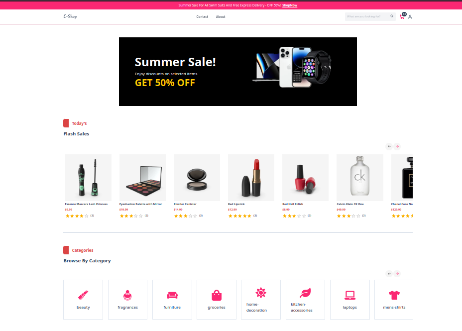

# EShop – E-Commerce Frontend

A modern, responsive **e-commerce web application** built with **Next.js** and **Tailwind CSS**, showcasing multiple rendering strategies (**SSG**, **SSR**, **ISR**, and **CSR**) for performance, SEO, and scalability. Deployed seamlessly on **Vercel**.

**Live Demo:** [Click here](https://e-commerce-delta-ecru-80.vercel.app)
**GitHub Repo:** [View on GitHub](https://github.com/d4nyaras/e-commerce)

---

## Features

- **Modern Tech Stack** – Built with Next.js (App Router) + Tailwind CSS
- **Multiple Rendering Modes** – SSG, SSR, ISR, and CSR implemented
- **Dynamic Product Pages** – Data fetched from [DummyJSON API](https://dummyjson.com)
- **State Management** – AuthContext & CartContext for global state
- **Responsive UI** – Mobile-first design with adaptive layouts
- **Optimized Deployment** – Hosted on Vercel with CI/CD
- **SEO-Friendly** – Server-rendered pages for better search indexing

---
